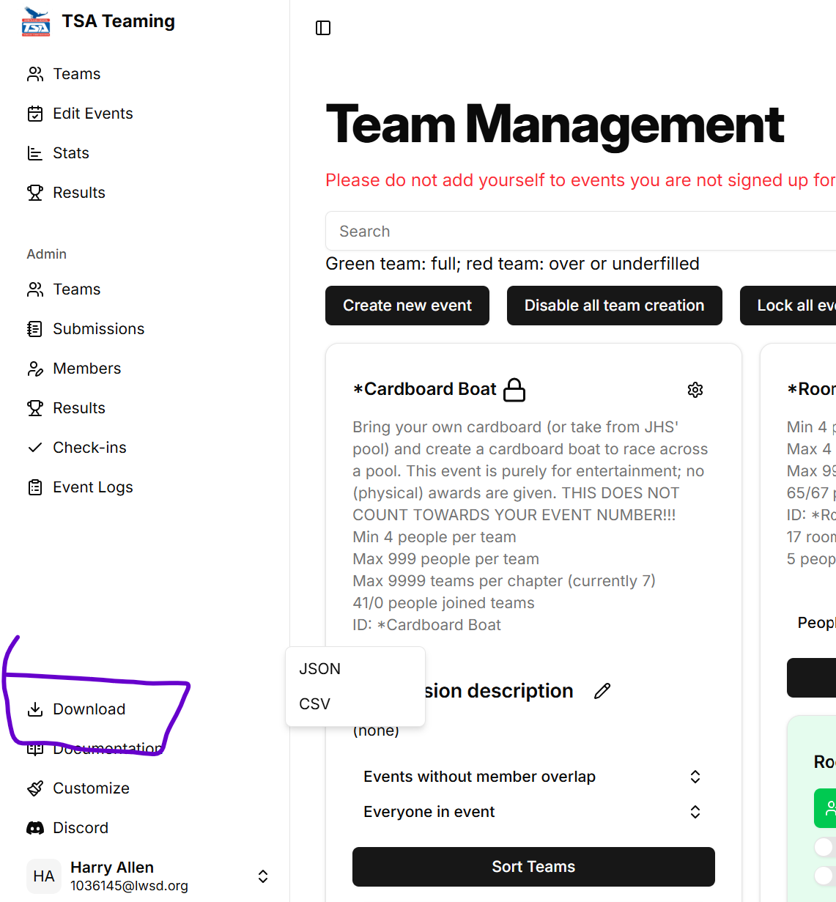

# Backups

Backups are a way to restore information in the case of lost data, whether through accidentally deleting information or technical error.

You can download a backup by clicking the "Download" button in the bottom of the sidebar.

Two options will come up: CSV and JSON.

## JSON Backups

JSON backups are the most complete form of backup. It contains all information on every page, outside of uploaded files (rubrics, submissions, files).

You should try to create backups every couple weeks, especially during the fall where team changes occur often.

In the event of data loss and you need to restore to that backup point, contact Harry at harry underscore allen at outlook dot com with the JSON file.

::: warning
Restoring from a backup is not perfect. It often looses the most recent changes. Ensure members are aware of this and work with them to fully restore the data.
:::

## CSV Backups

This backup is provided as it provides a more readable form of the data. It does not contain all information, rather it only contains member information, as well as their events (not their teams).
