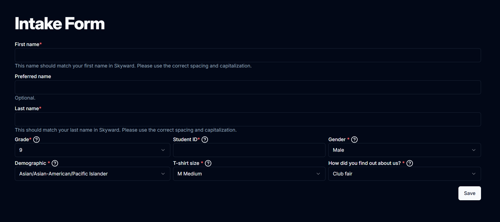
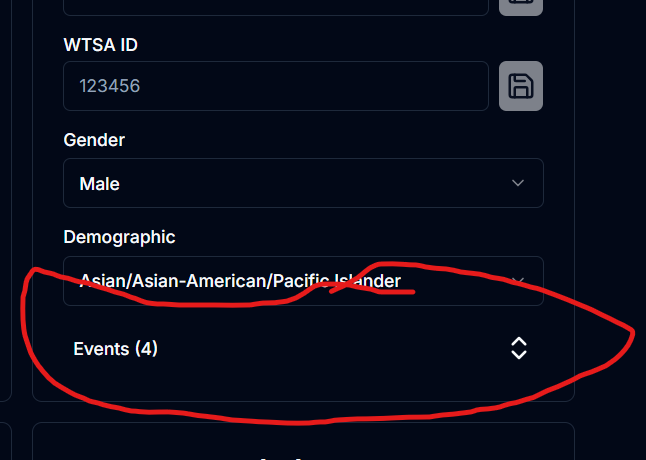
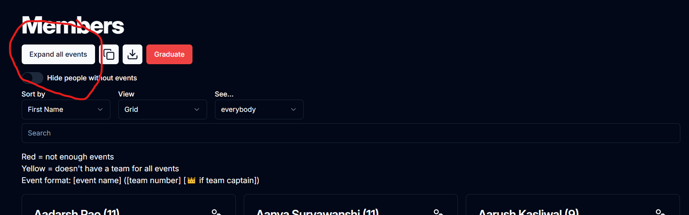

<script setup>
  import { MIN_EVENTS } from '../../src/lib/constants'
</script>

# Members

The [members page](https://teaming.jhstsa.org/admin/members) is a useful tool to organize members. This page is used for:

- Quickly looking at a member's events
- Getting a member's information (t-shirt size, gender, etc.)
- Modifying a member's information
- Registering member's for the January Qualifier and State conference

## Random Switch

This switch can be used for whatever you like -- use it for keeping track of who you registered, who paid their fees, or whatever else.

## Names

When a user initially creates an account, they will be prompted with the following intake form.



To access this form from the admin page, click the user cog in the top right of the member grid card or, whilst in list view, click the ellipsis on the far right of the row and click "Edit account."

The first three fields ask for the user's first, last, and preferred first name. The first and last name should **always** match what is in Skyward. This is what is used to keep track of which members have paid, so any deviation from Skyward will lead to confusion.

The preferred name always overrides the user's Skyward first name in the case of National affiliation as TSA doesn't care what people's actual names are.

When names are shown back to users (like in teams), the format, if there is a preferred name is `Preferred (Skyward) Last`.

### Gender and Demographic Fields

Occasionally, questions arise due to limited options present in both fields. These fields are exact copies of the information which National TSA requires from us, thus requiring our fields to match theirs.

Specifically for gender, National TSA gives the options of "Male," "Female," "Non-Disclosed," and "Opt-Out." In the teaming site, "Non-Disclosed" is replaced with "Non-Binary" and "Non-Disclosed" is replaced with "Other" (although in the admin page, it still states "Non-Disclosed").

## Member Page View Formats

There are two ways to view information on the members page:

### Grid

This is the view you should be using 99% of the time. You can see emails and whatnot here as well as modify user information. Click the user cog icon in the top right of each user to modify more obscure information, such as the user ID, name, and preferred name.

### List

Data will be formatted in a table, with each member assigned a row. Only the info needed for January Qualifier/State registration is shown. This view makes it easier to keep track of who you have registered and not much else.

Edit member details through the ellipsis on the right.

::: tip
This is also especially useful onsite at the State conference when distributing materials.
:::

## Displaying Events

In the list view, events are always shown. In the grid view, at the bottom of each member card, there is a collapsible (with the up/down arrows).



If the collapsible button is red, the user is under the {{ MIN_EVENTS }} event limit. You should talk to that person at some point to bring them up to {{ MIN_EVENTS }}.
If the collapsible button is orange, the user has {{ MIN_EVENTS }} events, but doesn't have teams for all of those events. You should talk to that person so that they have teams for at least {{ MIN_EVENTS }} events.
If the collapsible button is yellow, the user has enough teams and events, but doesn't have teams for all of their events.

### Editing a member's events

If you wish to edit the member's events, click the "Edit" button under the "Events" collapsible.

::: warning
From the admin page, this overrides all event locks and limitations. Before overriding a member's events, try to get the member to edit their events on their own (this also teaches them how to use the site). If it is necessary to override limitations, ensure that the member is able to find a team for that event (if the event is locked).
:::

### Understanding the event name format

Upon viewing events, the format is as follows:

```txt
[event name] ([team number] [👑 if team captain])
```

<svg xmlns="http://www.w3.org/2000/svg" style="display: inline" width="24" height="24" viewBox="0 0 24 24" fill="none" stroke="currentColor" stroke-width="2" stroke-linecap="round" stroke-linejoin="round"><rect width="20" height="12" x="2" y="6" rx="6" ry="6"/><circle cx="16" cy="12" r="2"/></svg> appears when the random switch for that team is on.

If you need to use the grid view and need to view everyone's events, at the top of the page, click the "Expand all events" button. This will have the equivalent effect of manually expanding everyone's events.


