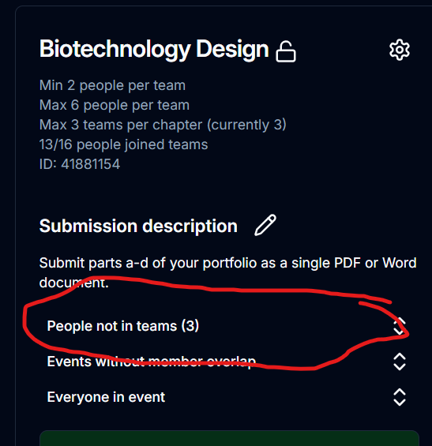

# Weird Quirks

This site has many quirks that have to be worked around. These quirks have mostly to do with admin pages as it is better to make board members' lives difficult than make the general member body's live's difficult.

## The admin page is slow

Yes.

## Navigating doesn't work

Refresh the page. This happens after a site update occurs.

## Removing a member from a team doesn't remove them from the event

A member's events and an event's teams are two separate things. Removing a member from an event won't remove them from their former team and vice-versa. This is to prevent people from accidentally leaving an event and losing their team (which is common -- the buttons are quite small). The consequence of this is that, every so often, an admin should go through and delete all white names in teams (outside of rooming). A green name denotes that the member is in the team and has signed up for the event. A white name indicates that the member is in a team and hasn't signed up for the event, so should probably be removed from the team.

If a member has signed up for an event but doesn't have a team, they will be under the "People not in teams" collapsible:

If an elimination has been completed and the unqualified teams removed, the members still need to be removed from the event. Open the collapsible and click the trash icon.

## Removing a member from an event doesn't remove them from their former team

See [above](#removing-a-member-from-a-team-doesn-t-remove-them-from-the-event).

::: info
This only affects admins as users who attempt to leave an event will be prompted to leave their team before leaving an event.
:::

## Results of teamed events which are completed individually are probably coloured incorrectly

Results are coloured by the number of teams/individuals which can be sent to the State conference. Therefore, the site assumes that eliminations were held with the teams/individuals which would be sent as-is to the state conference. Sometimes this assumption is incorrect.

## There are three ways to distribute files

Yes, and they exist for different purposes:

### Submissions

This should only be used for members getting files to admins, i.e., when members are submitting eliminations material. This is the only way that members should get files to admins.

### Results

This is exclusively for returning rubrics and other result info to members when the results are viewable on the results page (i.e., JHS eliminations and _not_ state results). It is only visible under the "View rubric" button on the results page.

### Files

This is exclusively for returning files which don't fit in the aforementioned categories. This should be used for:

- Returning rubrics from the state/regional conference
- Returning results from JHS eliminations which can't be returned through the rubrics page as there is no ranking (i.e., the elimination is feedback only).

## It's impossible to change an event's name

Yes. It's to prone to user error later. The best way to change an event name is to delete the old event and create it again with the new name. If you change the event name from the database, _this will not work_. Do not do this.

## There are too many ways to lock things

Yes, but they are all needed. When you open the event settings (cog icon in the top right of each event), there are three locking options:

### Lock event

All actions are prohibited. No one can sign up, leave, or create/leave/join teams for this event.

### Lock team creation when full

The event acts as unlocked. However, when the number of teams hits the maximum number of allowed teams/individuals for that event, no more teams can be created. If the event is individual and all spots have been taken, the event will appear as locked within the [edit events](../member/signup.md) page.

### Lock team creation

Same as before except teams can never be created.

## Team numbers for individual events are weird

Team numbers for individual events are a legacy thing. They don't matter and really shouldn't be used as individual event entries are tracked by member IDs. Just ignore them.

## Requests still exist after a member has joined a team

Yep. Just ignore it.

## Team numbers are out of order

The order is determined by the order of which the teams were created, not the team number. Click the "Sort Teams" right above the first team to sort all the teams in the event in numerical order of team number.

::: note
Although the "Sort Teams" button sorts the teams in the database, for members, if they are in a team, their team will always be first.
:::

## Some things update in realtime, others don't

Yep. Deal with it. Sometimes there is a refresh button. Typically, anything to do with files are not realtime, everything else is.

## X doesn't work on mobile

Yeah, you're probably right. Developing for mobile is a nightmare.
