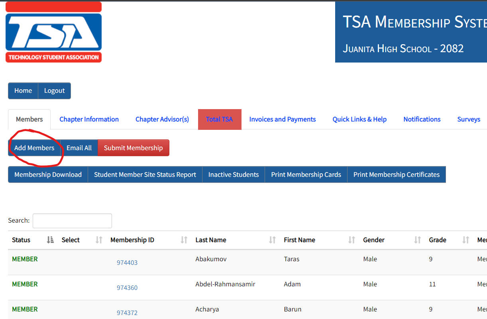
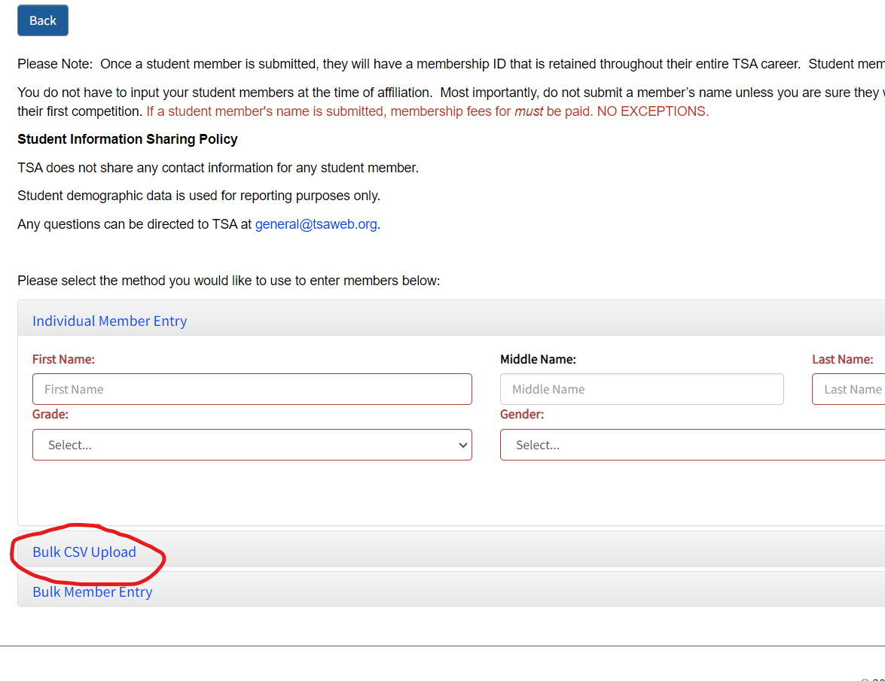
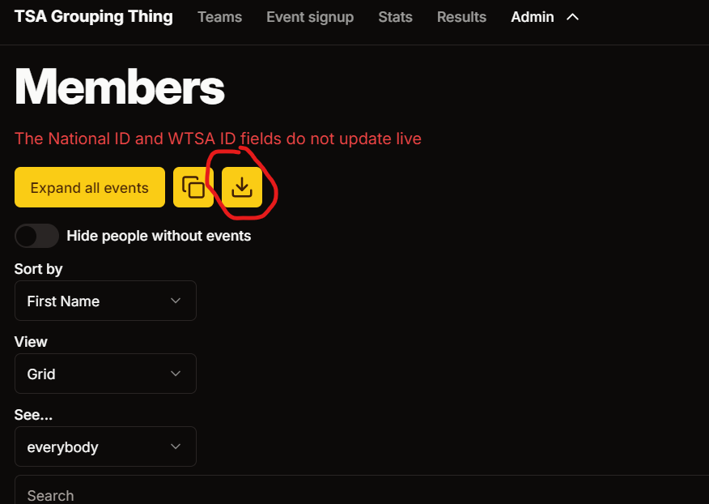
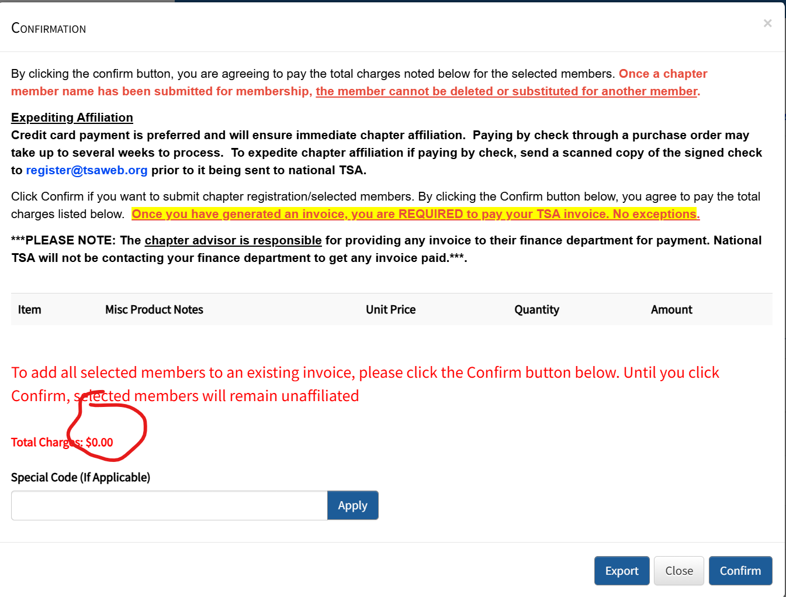
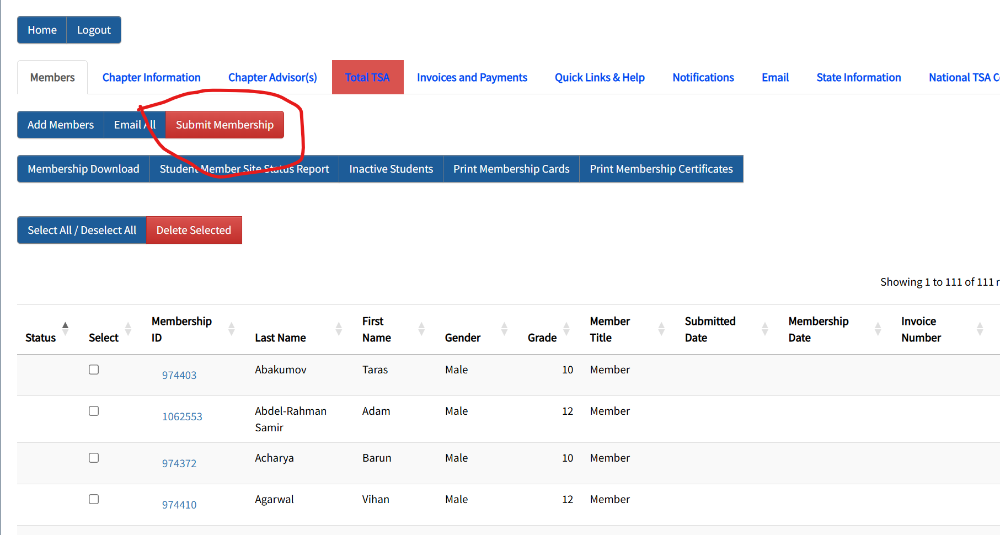
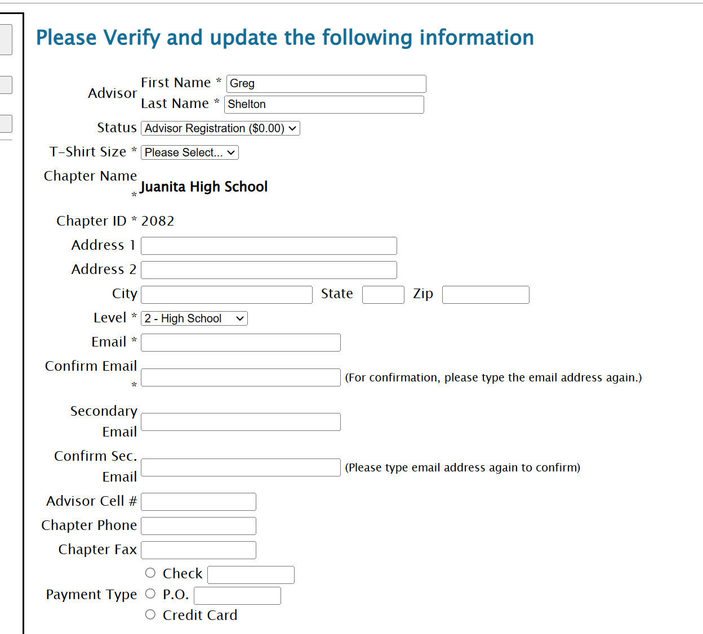
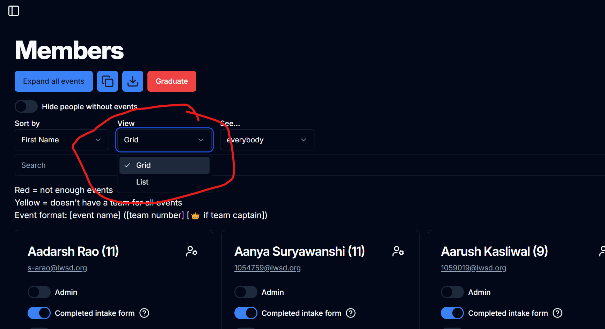

# Registering for the January Qualifier and State

The WA January Qualifier and state registration page is really bad. As this team creation wizard's database is different from WTSA's, normally, a lot of work (sometimes hours) must be put in to transfer data across systems. This can be rather tedious, as the event modification page looks like this:

So, to help streamline the transferring of events and other data, the Team Creation site has a few tools to streamline the process.

## Registering Students for Membership

Before registering anyone for any event, every member needs to first be registered to the [National TSA page](https://tsamembership.registermychapter.com/).

There are two ways to nationally register students: [assisted](#assisted) (which uses some features of the Team Creation site) or [manually](#manually).

Use the assisted method when you are registering a large number of members (such as during the January Qualifier registration). Otherwise, use the manual method (which can oftentimes end up faster with small numbers of members).

### Assisted

Once logged in, click the "Add Members" button under the tabs.

Scroll down and click the "Bulk CSV Upload" button.

The site will then ask you to upload a CSV file (don't worry if you don't know what this is). To get this file, go to the [members page](https://tsa-grouping-thing.vercel.app/admin/members) of the team creation site and click the download button below the large "Members" text.

This will download the members CSV file, and alert you to do a few things first.

#### Fixing up the Data

::: danger
Although it may not seem like it, this step is required.
:::

Once the file is downloaded, you must first make a few changes before you upload it to the TSA Membership system.

First, open up the file in Excel. Then, delete all rows with advisors. The rows cannot just be blank &#x02014; they need to be fully deleted (Home/Cells/Delete/Delete Sheet Rows). Advisors do _not_ need to be registered as they persist between years. Keeping these rows in will cause them to be registered twice. Next, look through the remaining rows. If any cell is blank, it _must_ be filled in. Similarly, if any cell contains the word "undefined," it must also be changed to the correct value.

Some cells have restrictions on the value they can hold. If they do not adhere to one of the specified values (to the exact character), members will not be registered correctly. Here is a list of those restricted columns:

| Column name     | Possible values                                                                                                                                                                       |
| --------------- | ------------------------------------------------------------------------------------------------------------------------------------------------------------------------------------- |
| Grade           | `9`, `10`, `11`, `12`                                                                                                                                                                 |
| Gender\*        | `Male`, `Female`, `Opt-Out`, `Non-Disclosed`                                                                                                                                          |
| Demographic\*\* | `American Indian/Alaskan Native`, `Black / African-American`, `Asian/Asian-American/Pacific Islander`, `Hispanic/Latino`, `Mixed Race`, `White/Caucasian`, `Opt-Out`, `Non-Disclosed` |

\*In our membership system, "Non-Disclosed" is sometimes represented as "Non-Binary" as the State registration system uses "Non-Binary." When registering people for National TSA, you must use "Non-Disclosed," not "Non-Binary" (although "Non-Binary" must still be used for State).

\*\*The `Black / African-American` demographic is the only demographic to have spaces around the slash. This appears to be a typo, but the same value must still be used (with the spaces).

After you edit all the necessary cells, save the file. If Excel prompts you to "change the file type to preserve formatting," click no. The file type must remain as a CSV.

#### Uploading the Data

After you've saved the file, go back to the National membership site and drag the CSV file to the blue box. Go through each row to ensure that the information is correct. If an item is red, click the pencil icon on the right and fix the error. The red fields are required. Then, click "Save and Finish" (at the bottom).

Before you can register anyone for any WA events, they need to be affiliated first. In the second to the left column of the Members tab, select all the members and click the red "Submit Membership" button towards the top of the page, underneath the tabs and click through all of the disclamers.

::: danger
When you click "Submit Membership," the total charge should be $0.00. IF THIS IS ANYTHING OTHER THAN THAT, DO NOT PROCEED -- YOU WILL CHARGE JHS TSA WITH THOUSANDS OF DOLLARS WHICH WE DON'T HAVE!!!

:::

Once you submit membership, the names of members cannot be changed, so make sure all names are correct before submission.

If you find out that a member's name is incorrect, there is no way to change the name or delete the member. You will instead have to create a new member and hopefully not get confused between the two almost duplicate members. So, make sure that all information is correct before membership submission.

### Manually

Go to the [members page on the team creation site](https://teaming.jhstsa.org/admin/members).

Then, log in to the [National membership page](https://tsamembership.registermychapter.com/). It's best to split your screen into two, but you can use the grid view to add all necessary data. Use the "Bulk Member Entry" accordion section in the national site to speed up this process.

The title for everyone except board members should be "Member."

## Registering for the State Conference

Only after has National membership been submitted can members be added to any State level event.

To register for Washington events, head to their [registration page](https://www.registermychapter.com/tsa/wa/Register.asp), and log in with the same username and password.

When you first log in, you'll see a page with a questionnaire. Let Mr. Shelton fill this out.

Before you assign students their events, you'll need to register them. At the bottom of the page, click "Add Students." There will be a search bar. Don't put anything there, and just click "Search." For every member that payed the qualifier fee, under "Status," change it to "January Qualifier."

::: danger
It may be tempting to change the status of every member shown. **_If you do this, go back over and ensure that everybody registered has payed the fee. Failure to do so will charge us thousands of dollars which we don't have._**
:::

Then, you'll need to manually add every single person you just added to the Nationals page to the State page. There is no way to automatically do this. Have fun!

If you need to check for errors in the registration (like exceeding event limits), click the "View Registration" button at the bottom of the page.

You can use the team creation site's [member page](https://teaming.jhstsa.org/admin/members) list view to assist with this (it might be best to split your screen). The number in parenthesis is the team number. If there is a crown, the member is a team captain.

