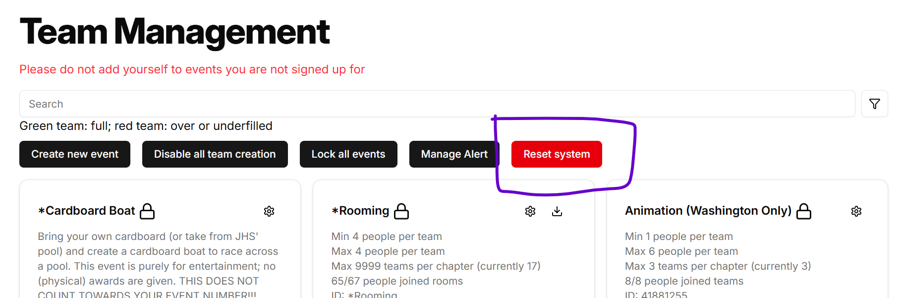

# Resetting the System

::: danger
The actions resulting by resetting the system are irreversible and should **only** be preformed at the end of the year. If you prematurely reset the system, well, you'd better hope you have a backup.
:::

At the end of the year, the system must be reset to allow for next year's teaming to work. There are two parts to resetting the system:

- [Resetting the teams](#resetting-the-teams) (clears teams, results, alerts, etc.)
- [Graduation](#graduation) (increments members' grades, clears outgoing seniors)

These can be completed in any order. Both are necessary.

## Resetting the Teams

::: danger
This action is irreversible.
:::

To reset the teams, go to the admin teams page, and under the search bar, click the red "Reset system" button.

This will bring up a bunch of confirmation dialogs since this action is irreversible. It preforms the following actions:

1. It downloads a backup file in `json` format in the event that data needs to be restored. Not all data can be restored, but most of it can. If you need to restore data, email harry underscore allen at outlook dot com. See more about backups on the [respective page](./backups.md).
2. It resets all the events by doing the following:
   - Deletes all teams
   - Deletes all results
   - Unlocks the event
   - Disables online submissions
   - Unlocks team creation
   - For rooming and cardboard only, it disables them by hiding the events from members.
3. It globally disables online submissions.

::: warning
Resetting the system does not reset submission descriptions, as it assumes they need little change throughout the years. Before enabling submissions, it might be best to ensure that dates and prompts are correct.
:::

It keeps the following data:

- Event limits (min/max members per team, max teams per chapter, submission descriptions, event descriptions).
- All member information (use the [Graduate](#graduation) function below for resetting that).
- The events which members signed up for.

## Graduation

Graduation resets the individual members.

Graduation attempts to mimic the graduation functionality in the advisor National TSA portal. Graduation must be completed in addition to resetting the teams. Graduation can be completed in the admin members page by clicking the red "Graduate" button above the search bar (as opposed to below the search bar in the admin team management page since consistency is bad).

Graduation resets the following things:

1. It deletes all members who don't have any events. Members who don't have any events by the end of the school year are unlikely to return to TSA and are just clogging up the system.
1. It removes all members' events.
1. It increments all users' grade by one and deletes all outgoing seniors.
1. It forces users to re-fill out the intake form.
1. It deletes the members' Washington IDs (these change every year and are assigned when everyone is first registered for the January qualifier).
1. It unlocks users' events.
1. It unlocks users' rooming ability.
