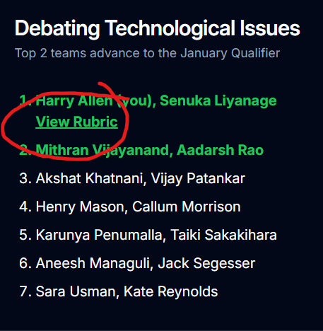

# Results

This page exists to help to determine placement of eliminations. It also provides a way to return rubrics back to teams. There are actually 2 ways to add results: through the results page and through the [submissions page](./submissions.md). It is easier to add results from the submissions page, but provides less flexibility as to who can be in each result team (for example, it would be impossible to generate results for tech bowl eliminations through the submissions page as people take the test separately). If you already know the teams and placement for each ranking, you should probably use the submissions page. If you want to manage/change the results or do anything else with results, you should probably use the results page.

## Posting Results

Go to the [admin results](https://teaming.jhstsa.org/admin/results) page and find the event for which you want to add results for. Click Add and fill in the inputs for the data. If you want to add a rubric, click the Upload Rubric button to the left of the Add button. This rubric will be shown to every user in the team when the click the "View rubric" button next to their result.

## Modifying Existing Results

If you want to modify results that have already been posted, click the pencil icon directly underneath the list of names of the team whose results you want to change. You can then add or change members of that team, add or change notes, or add or change rubrics in the same way when then result was added.
