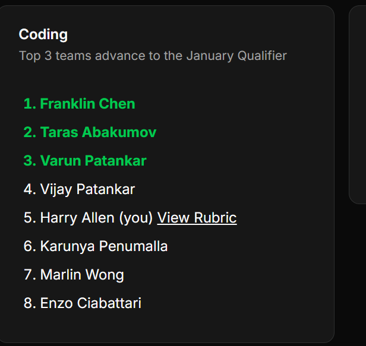

# Results

Results are placements after an elimination has taken place. They show the rankings for all teams/members who participated in an elimination as well as a rubric for your specific team, if available.

Clicking the "View rubric" button brings up the rubric, which can be in either text or image format.
