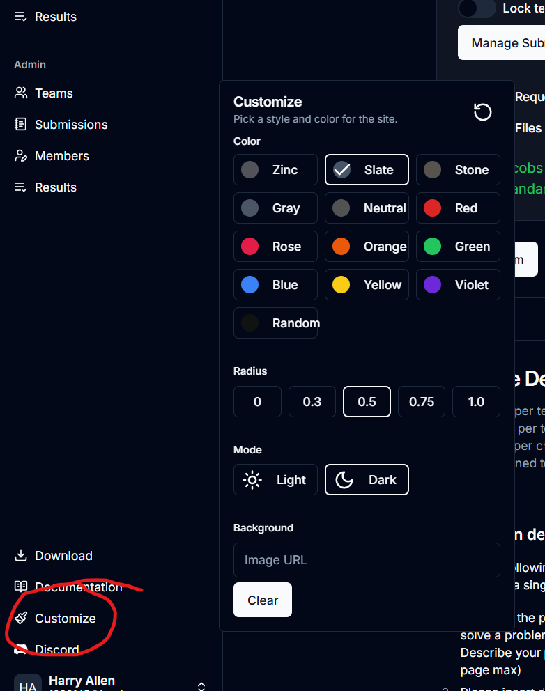

# Theme Customization

By clicking the "Customize" button in the bottom-left corner of the sidebar, you can bring up a customization popup.

## Color

The colors under the "Color" header are theme colors. This is the color which most buttons will be. The background sometimes is tinted towards that color. The "Random" color makes basically every different UI element a different color. Continuously clicking it will continuously change the color.

## Radius

This is the roundness of elements. A larger number yields rounder elements.

## Mode

Light mode is light, dark mode is dark.

## Background

When a user places a URL in this input, the image will be tiled as a background throughout the app. To add an image, search for an image, right click it, select "Copy image as URL," and paste it into the input. Leaving the input blank will remove the image.
